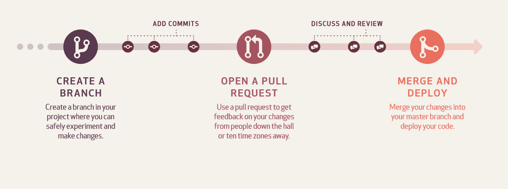

> Harvard's Web Programming with Python and Javascript lecture 0 정리

### Git and GitHub
- __Git__ : _version control tool_ 
    - to keep track of changes made to code,
    - synchronize code btw different ppl,
    - test changes to code w/o losing the origin,
    - and revert back to old versions of code.
- __GitHub__ : website that stores Git repositories on the internet to facilitate the collaboration that Git allows for.
    - __repository__ : a place to keep track of code and all the changes of code.

### Git

#### Git Commands
- `git clone <url>`: download a repository stored on a server (like GitHub).
- `git add <filename(s)>`: add files to the staging area to be included in the next commit.
- `git commit -m "<message>"`: take a snapshot of the repository and save it w/ a message description
- `git commit -am <filename(s)> "<message>"`: add files and commit changes all in one.
- `git status`: print what is currently going on w/ the repository; show current status.
- `git push`: push any local changes (commits) to a remote server
- `git pull`: pull any remote changes from a remote server to a local computer.
    - when combining two different versions of code, a __merge conflict__ can occur if the versions have differnt data in the same location.]
    - _must manually fix_ conflict (where <<<< ==== >>>> is) and then, commit and push results.
- `git log`: print a history of all the commits that have been made.
- `git reflog`: print a list of all the different references to commits.
- `git reset --hard <commit #>`: reset the repository to the given commit.
    - `git reset --hard origin master`: reset the repository to its original state (the version cloned from GitHub).
- `git init`: initialize empty git repository in local computer.

### GitHub

#### Remote
- any version of a repository that is not stored locally on a device. (ex. GitHub)
- origin = the remote from which the local repository was originally downloaded from.
- __Git commands__ related to remotes.
    - `git fetch`: download all of the latest commits from a remote to a local device.
    - `git merge origin/master`: merge the downloaded repository version in the local, preexisting master branch; update master.
    - `git pull`: git fetch + git merge origin/master

#### GitHub Flow

#### Branching
- feature of Git that allows a project to move in multiple different directions simultaneously.
    - there is one __master branch__ that is always usable.
    - but _any number of new branches_ can be created to develop new features.
    - when ready, these branches can be _merged back_ into the master branch.
- HEAD: refers to the current branch being worked on.
- __Git commands__ related to branching
    - `git branch`: list all the branches currently in a repository.
    - `git branch <name>`: create a new branch with a name.
    - `git checkout <name>`: switch current working branch to the named branch.
    - `git merge <name>`: merge the named branch into current working branch (normally master)
      - if merge conflict occurs, must manually fix it.
      - if a branch is pushed w/o merge or the branch does not exist on GitHub, use `git push --set-upstream origin feature`.

#### Forking
- fork = an entirely separate repository copied off of the original repository.
    - can be managed and modified like any other w/o affecting the original copy.
- specific feature of GitHub (fork가 branch의 상위개념)

#### GitHub Pages
- feature of GitHub which allows for a repository to be _deployed on the internet_.
- use: settings -> GitHub Pages -> select master branch & save.
    - by default, the repository will be deployed to username.github.io/repositoryname
    - if repository is updated, GitHub Pages will be automatically updated as well.