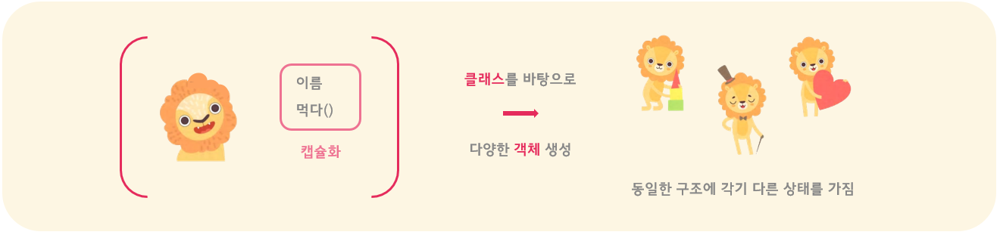
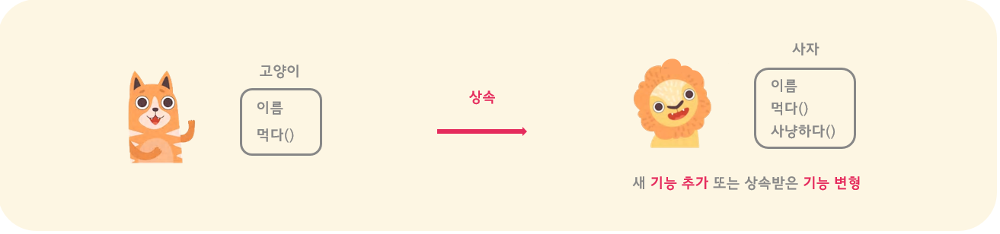
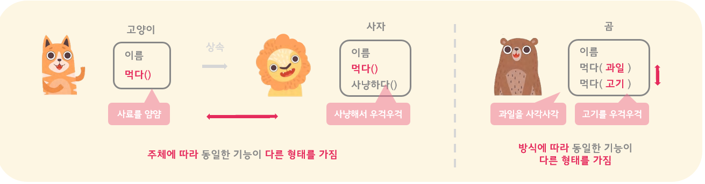

### 객체지향 프로그래밍 (Object-oriented Programming)
객체지향 기술은 말 그대로 `Object`를 중심으로 하는 개발 방식이다. 컴퓨터공학 분야에서는 이를 __`객체`__ 라는 조금 생소한 표현으로 사용하지만, 사전적 의미 그대로 물건 또는 물체라고 생각하면 더 쉽게 와닿는 것 같다. 즉, 객체지향 프로그래밍은 물체 단위로 프로그램을 짜고 물체과 물체 사이의 관계에 중점을 둔 작동방식을 개발하는 방식이라고 할 수 있다. 
- 객체 단위로 연관된 데이터와 함수를 묶어 개발하고 사용한다.
```c
// 객체의 예시: 물병
    bottle {
        material, contents, cap; // 속성
        open(), fill(), close(), empty() // 기능
    }
```

#### 왜 객체 지향적인 프로그래밍이 필요한가
- 프로그램이 복잡해질수록 __데이터를 관리하는 문제__ 가 생기기 시작했다.
```c 
// 전역 변수
int anyoneCanUse;
// 전역 변수를 공유하는 함수들
int function_1() { anyoneCanUse++; }
int function_2() { anyoneCanUse--; }
```
    - ex. 프로그램 내의 서로 다른 함수가 하나의 데이터를 공유해야 되어, 전역변수를 사용하는 경우
    - 프로그램이 복잡해지고 동일한 데이터를 접근하는 함수들이 많아질수록, 점점 그 데이터가 올바르게 조작되고 있는지를 관리하기가 힘들어진다. 
    - 특히, 의도와 다르게 조작될 확률도 커지기 때문에 프로그램에 에러가 발생하는 큰 문제가 될 수 있다. 
- 그래서 구조체를 만들 듯이, __데이터와 함수들을 객체(object) 단위로 묶어 실제 세상과 비슷하게 모델링하고 관리하는 방식__ 이 사용되기 시작했다.
```cpp
// 객체 안에 서로 관련된 데이터와 함수들을 묶음
    class GroupedInObject {
        private: 
            // 오직 클래스 내의 함수들만 접근 가능
            int classMembersOnly;
        public:
            // 클래스 내의 함수들끼리는 데이터를 공유하면서,
            // 그 외의 함수들로부터는 데이터를 보호
            int function_1() { classMembersOnly++; };
            int function_2() { classMembersOnly--; }
    };
```

#### OOP의 장단점
|  |  |
|:---|:---|
| __장점__ | 소프트웨어의 재사용률, 확장성, 유지보수성이 높아지므로 규모가 큰 프로젝트 개발에 적당하다
|  | 실세계에 근접한 자연적인 모델링이 가능하며, 사용자 타입 중심이다 |
| __단점__ | 객체를 설계하기가 어렵다 |
|  | 객체의 규모가 크기 때문에 실행 속도가 느리다 |


### OOP 의 큰 그림과 주요 개념들
객체지향 프로그래밍은 앞서 살펴 본 예시와 같이 데이터와 함수들을 하나로 묶어 __객체 단위__ 로 프로그램을 짜는 방식이다. 이렇게 객체 단위로 속성과 기능을 묶는 과정을 바로 __캡슐화__ 라고 한다.

1. __`캡슐화`__`(encapsulation)`: 연관된 __데이터와 함수들을__ 캡슐처럼 __하나의 테두리로 묶는 것__
    - 외부와의 경계를 만들어 내부 정보를 숨기고 외부에는 사용하는데 필요한 정보만을 담은 인터페이스를 공개함으로써 내부 정보가 외부의 영향을 받거나 주지 않도록 보호한다 (정보 은닉) 
    - 데이터와 함수들을 하나로 묶은 템플렛인 클래스를 사용하면 프로그램의 컴포넌트로 재사용이 가능해진다

이런 방식으로 객체들을 중심으로 개발을 진행하다보면 무수히 많은 객체들을 일일이 만들어야 하는 비효율적인 문제가 생긴다. 그래서 반복 잡업을 줄여보고자 객체들의 공통적인 특성들을 묶은 템플렛을 사용하기 시작했다. 이를 __클래스__ 라고 부르며, 클래스라는 틀을 통해 마치 판을 찍듯이 __같은 구조를 가지는 여러 객체들을 생성__ 할 수 있게 된 것이다. 더 구체적으로 설명하자면, 클래스를 통해 같은 구조를 가지면서 다른 상태를 가지는 여러 객체들을 생성할 수 있게 되었다.



하지만 클래스를 통해 같은 구조에 다른 상태를 가지는 객체들을 만들 수는 있어도, 여러 클래스들을 사용하여 객체들을 만들다 보면 또 비슷한 기능을 가진 클래스들을 반복하여 만들어야 하는 비효율성이 발견된다. 그래서 이번에는 새 클래스들 간의 공통적인 부분들을 묶는 상위 클래스를 정의하고 이를 다른 클래스들이 __상속__ 하게 함으로써, 공통적인 기능을 작성한 코드를 재사용하고 보다 효율적으로 비슷한 기능을 정의하는 여러 클래스들을 만들 수 있게 되었다.

2. __`상속`__`(inheritance)`: 한 클래스가 다른 클래스의 __데이터와 메소드를 그대로 물려받아 쓰는 것__
    - 중복된 코드를 줄이고 기존의 클래스를 __확장 또는 변형__ 하는 새로운 클래스를 만들기 위해 사용된다 (다형성)

여기서 눈여겨보아야 할 점은 객체들의 공통적인 부분들을 정의하는 클래스와 클래스들의 공통적인 부분들을 정의하는 상위 클래스를 사용하는 목적의 차이이다. 클래스의 경우에는 같은 구조를 가지지만 다른 상태를 지니는 객체들을 여럿 생성하기 위해 사용되는 반면, 상위 클래스를 상속하는 방식은 __비슷한 기능들을 가지는 객체들을 정의하는 여러 클래스들을 만들기 위해__ 사용된다.

예를 들면, 클래스는 '사자'라는 틀을 정의함으로써 아기 사자, 암컷 사자, 수컷 사자 등의 여러 다양한 사자 개체들을 만드는데 사용될 수 있다. 반면에, 상위 클래스를 상속하는 방식은 사자 클래스가 비슷한 구조와 기능을 가진 '고양이' 클래스를 정의한 데이터와 메소드 코드를 재사용하여 정의하는 것이다. 하지만 여기서 단순히 사자 클래스가 고양이 클래스와 똑같이 일치하기만 한다면 사실상 상속을 하는데 큰 의미는 없을 것이다. 왜냐하면 그럴 경우에는 불필요하게 중복된 클래스를 작성하는 것뿐인 모양이 되기 때문이다. 그렇기 때문에 상속을 사용하는 목적은 __같은 기능을 중복 작성하는 작업을 줄이고 그 외 새 기능을 추가하거나 상속받은 기능을 변형하는데 집중을 하기 위함__ 이라고 생각한다. 즉, 상속은 클래스처럼 단순히 틀을 제공하여 판 찍듯이 다른 것들을 생성할 수 있게끔 하는 방식이 아니라, 기존의 클래스의 기능을 가져다 쓸 수 있게 함으로써 새 클래스의 기능을 확장하거나 변형하는데 목적을 둔다고 할 수 있다.



이런 식으로 클래스들의 기능을 확장하거나 변형한 결과로 객체가 가지는 기능들이 다양하게 표현될 수 있게 되는데, 이러한 성질을 바로 __다형성__ 이라고 부른다.  

3. __`다형성`__`(polymorphism)`: __객체가 다양한 형태로 표현되는 성질__
    - 상속을 통해 만들어진 객체는 자신의 __본래 클래스 형태와 상위 클래스 형태로 모두 표현이 가능__ 하다.
    - 다른 클래스로부터 상속받은 기능을 자신에게 맞는 형태로 변형을 하여 재작성(__오버라이딩__)하는 과정을 통해 __하나의 기능이 사용하는 주체가 어떤 클래스의 객체인지에 따라 다른 형태로 표현__ 될 수 있다.
    - 그 외, 동일한 클래스 내에서도 하나의 기능에 조금씩 변형을 하여 중복 작성(__오버로딩__)하는 과정을 통해서도 __하나의 기능이 사용하는 방법에 따라 다른 형태로 표현__ 될 수도 있다.

조금 쉽게 다형성을 풀이해보자면, __하나의 객체가 다양한 경우에 적용될 수 있는 성질__ 을 가진다는 의미이다. 앞의 예시를 통해 살펴보자면, 일단 기본적으로 사자 객체는 사자 클래스를 통해 만들어졌으므로 사자에 속하지만, 동시에 고양이 클래스를 상속받았기 때문에 고양이에 속하기도 한다. 즉, 사자 객체는 사자와 고양이 두 가지 형태 모두가 가능한 것이다. 

이런 식으로 하나의 객체가 두 가지의 형태 를 가지게 되면, __더 다양한 클래스의 객체들을 포용할 수 있는 기능을 구현하기가 용이__ 해진다. 예를 들면, '사람'이라는 객체가 있고 이가 다른 객체에 대해 '먹이주다()'라는 기능을 가지게끔 정의하고자 하는 경우를 살펴보자. 각각 고양이와 사자에게 먹이를 주는 기능을 따로 작성할 수 있을 것이다. 하지만 만약 두 기능의 작동방식이 완벽하게 일치하고 단순히 대상 객체의 클래스만 다르다면, 이러한 방식은 중복된 코드를 작성하는 것이기 때문에 비효율적이다. 다행히 사자 클래스의 객체들은 고양이 클래스로부터 상속되어 다형성을 가지고 있기 때문에 고양이 형태로도 사용이 가능하다. 엄연히 따지면 사자에 속하는 객체이지만, 사자 또한 고양이이기 때문에 마치 고양이처럼 취급하여 먹이를 주어도 큰 문제는 없다는 이야기이다. 즉, 객체가 가지는 다형성 덕분에 __반드시 해당 클래스에 맞춰 기능을 정의하여 객체를 사용해야 할 필요성이 줄어드는 것__ 이다.


또, 객체가 가지는 다형성 중 중요한 한 가지는 __객체의 기능이 다양하게 작동할 수 있는 성질__ 이다. 앞서 상속은 기능을 새로 추가하거나 변형하는데 의미가 있다고 했었는데, 바로 이렇게 기능을 변형함으로써 나타나는 성질 또한 다형성이라고 할 수 있는 것이다. 예를 들어, 고양이가 '먹다()'라는 기능을 가지고 있고, 사자가 이를 상속받아 자신에게 맞는 형태로 변형한 경우를 들 수 있다. 고양이의 먹는 기능은 사료를 먹는 형태지만, 사자의 경우에는 사냥해서 먹는 형태가 될 것이다. 여기서 중요한 부분은 __기능의 의미는 크게 변하지 않고 오로지 형태만이 변형__ 된다는 점이다. 이렇게 되면, 먹다라는 기능의 의미는 하나이지만, 사용하는 주체에 따라 그 기능이 다양한 양식으로 표현될 수 있게 된다. 

그 외, 상속을 통하지 않고서도 기능을 다양한 형태로 표현하는 방식도 존재한다. 이는 동일한 클래스 내에서 하나의 기능을 조금씩 다른 방식으로 사용하는 방법으로 



이렇듯 상속은 다형성을 최대한 효과적으로 구현하기 위해 가능한 계층적인 구조를 위주로 설계된다. 그 중 추상적인 개념을 사용하면 새로운 클래스를 추가하는 경우에 특히 유용 => 추상 클래스

4. __`추상화`__`(abstraction)`: 

고양이-사자는 사실상 효율적인 설계는 아닐 것이다. 여러가지 호랑이, 사실상 그렇다면 고양이과라는 표현이 더 올바를 지도 모른다

더 일반적인 경우도 사용할 수 있게끔

캡슐화, 상속, 다형성을 통해 코드를 재사용할 수 있게 함으로써 소프트웨어 생산성을 높인다

공통적인 특성들과 행동들을 한데 묶어(추상화) 클래스에서 재사용(상속)하고, 오버로딩과 오버라이딩을 통해 클래스 간 서로 다른 변화를 적용(그 결과로 다형성을 띰)한다