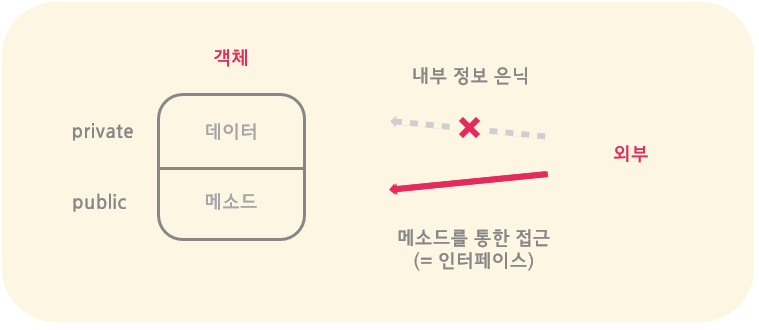

### 클래스 (Class)
클래스는 __객체를 쉽게 만들기 위해 공통된 특성을 묶어 정의한 템플릿__ 이다. 즉, 클래스라는 틀을 바탕으로 동일한 구조를 가지면서 각기 다른 상태를 지니는 객체들을 쉽게 만들 수 있다. 클래스를 통해 객체를 만드는 방식은 다음과 같다.  
1. 클래스로 __객체의 상태를 저장하는 변수(field)__ 와 __기능 또는 행동을 명시하는 함수(method)__ 를 정의한다.
```java
    // 사자 클래스 정의
    public class Pokemon {
        // 접근이 제한된 필드: 상수와 변수
        private int id;
        private String name;
        // 접근이 공개된 생성자 메소드
        public Pokemon(int n, String s) {
            id = n;
            name = s;
        }
        // 접근이 공개된 메소드
        public void display() {
            System.out.println(name);
        }
    }
```
2. 이러한 클래스를 바탕으로 다양한 종류의 __객체 인스턴스(instance)를 만들어 사용__ 한다
```java
    // 스케치 클래스 정의
    public class Game {
        // 메인 함수만 있기에 때문에 스케치 클래스는
        // 피카츄 클래스를 테스트하기 위한 드라이버 코드이다
        public static void main(String[] args) {
            // 피카츄 클래스를 바탕으로 인스턴스들을 생성 
            // (피카츄가 두 마리)
            Pokemon pikachu = new Pokemon(25, "pikachu");
            Pokemon raichu = new Pokemon(26, "raichu");
            // 만들어진 인스턴스의 메소드 사용
            pikachu.display();
        }
    }
```

쉽게 비유하자면, __클래스는 붕어빵 틀__ 이고, 그 틀에 어떤 재료를 넣는 지에 따라 __붕어빵 또는 슈크림빵__ 이라는 서로 상태가 다른 인스턴스 __객체__ 를 만들 수 있는 것과 유사하다.

#### This 레퍼런스 (`this`)
객체 자기 자신을 가르키는 레퍼런스이다
- 주로 같은 이름의 변수와 구분할 때 또는 해당 객체의 다른 메소드나 생성자를 호출할 때 사용된다
```java
    public class Pokemon {
        // 매개변수와 구분하기 위해 this 사용
        public Pokemon(int id, String name) {
            this. id = id;
            this.name = name;
        }
        // 생성자를 호출하기 위해 this 사용
        public void chooseFirstPokemon() {
            this.display();
        }
    }
```

### 캡슐화 (Encapsulation)
서로 관련된 데이터와 함수들을 __캡슐처럼 하나의 객체로 묶어__ 관리함으로써 __객체 내의 정보를 숨기는 것__



- 캡슐화를 통해 __객체 내부 정보는 외부로부터 은닉__ 되며, 일종의 추상화를 통해 __객체의 데이터를 보호__ 한다
- 객체의 데이터는 __공개된 메소드__ 를 통해서만 __접근이 가능__ 하다 (일종의 __인터페이스 제공__)
- __재사용성이 높아지고 테스팅이 쉬워진다__
- 일반적으로, 대부분의 객체지향 언어들은 __`클래스` 를 사용하여 캡슐화를 이루고 있다__
    - 클래스를 통해 서로 관련된 데이터와 함수를 묶는 객체의 틀을 정의
    - 클래스 내의 접근 지정자들을 통해 정보를 은닉

#### # 접근 지정자
클래스 내의 데이터 또는 메소드에 대한 접근 범위를 정의하는 지정자 

| 접근 지정자 | 같은 패키지 클래스의 접근 | 외부 클래스의 접근 | |
|:---|:---:|:---:|:---|
| `default` | O | X | 같은 패키지 내에서만 접근 허용 |
| `private` | X | X | 정의된 클래스 내에서만 접근 허용 |
| `protected` | O | X | 같은 패키지 내에서만 접근 허용 |
| | | | (단, 자식 클래스에서는 접근 가능) |
| `public` | O | O | 외부까지 모두 접근 허용 |

- 일반적으로, 클래스 내의 데이터 필드는 private로 정의되는 반면, 메소드 필드는 public로 정의된다

#### # 메소드를 통한 데이터 접근
일반적으로 클래스는 __메소드를 통해서만 데이터에 접근__ 할 수 있는 인터페이스 제공한다
```java
    public class Account {
        // 데이터에 직접적인 접근 불가
        private String name;
        private int balance;
        // Accessor 메소드: 값 확인
        public String getName() { return name; }
        public int getBalance() { return balance; }
        // Mutator 메소드: 값 변경
        public void setName(String name) { this.name = name; }
        public void setBalance(int balance) { this.balance = balance; }
    }
```

#### # 클래스 전역변수와 전역함수 
- `static` 키워드로 __클래스 전체에 통용__ 되는 __변수__ 또는 __함수__ 를 정의
```java
    class Pokemon {
        ...
        // 클래스 전체에 공유되는 static 멤버 선언
        static int count;
        // 동일한 클래스의 모든 객체에 의해 공유되는 static 메소드 선언
        static void printCount() { System.out.println(count);}
    }
```
```java
    public class Game {
        public static void main(String[] args) {
            // 클래스 이름으로 static 변수와 함수 접근
            Pokemon.count = 0;
            Pokemon.printCount(); // 0
            // 객체 멤버로 static 변수와 함수 접근
            Pokemon pikachu = new Pokemon();
            pikachu.count++;
            pikachu.printCount(); // 1
        }
    }
```
- static 변수 또는 함수는 __클래스 전체 이름으로 접근__ 하거나 __객체를 통해 접근__ 하여 사용할 수 있다
- 특히, 다른 모든 클래스에서 공유하는 전역 변수나 전역 함수의 경우, static을 사용하여 하나의 클래스로 묶어 정의하면 유용하다 (자바에서의 캡슐화 원칙)
```java
    // EX. java.lang.Math 클래스 (모든 메소드가 static으로 정의됨)
    // 굳이 객체를 생성하지 않고 바로 호출할 수 있는 상수와 메소드 제공하기 때문에 
    // 그대로 사용하는 것이 더 효과적이다
    // 올바른 사용법       | 권하지 않는 사용법 
    int n = Math.abs(-5); | Math m = new Math();
                            int n - m.abs(-5);
```