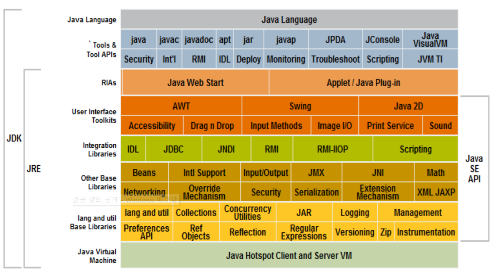

### 자바 언어 (Java)
__플랫폼 독립적인 클래스 기반의 객체지향 프로그래밍 언어__

1. "__Write once, run anywhere__": 자바 프로그램이 컴파일된 바이트 코드(byte code)는 JVA가 있는 어떠한 플랫폼에서도 실행이 가능하다
    - 자바 소스 파일(.java)은 자바 컴파일러인 javac을 통해 __바이트 코드(.class)로 컴파일__ 된다
    - 바이트 코드(.class)로 된 파일은 __JVM(Java Virtual Machine)이 인터프리터(interpreter) 방식으로 해석하고 실행__ 한다 (각 플랫폼마다 호환되는 JVM이 있기 때문에, JVM만 있으면 플랫폼 호환성을 해결할 수 있다)
    - 즉, 프로그래머는 호환성 문제를 신경 쓸 필요 없이, __자바 프로그램 하나만을 작성하면 JVM이 있는 어떤 환경에서든 사용가능해진다__
    - cf 그림 일러 추가하기) C언어의 경우에는 각 OS에 따라 다른 컴파일러를 가지고 있어 컴파일되는 최종 .exe 기계어 파일이 달라지기 때문에 이를 다른 환경에서 실행할 수 없다. (사용을 위해서는 실행되는 파일을 다운받아 사용하는데, 한 c파일 당 여러 컴파일러들을 통해 컴파일 환경에 맞는 다양한 exe파일을 제공해야만 한다) 그에 반해 java는 완전히 최종 컴파일된 기계어를 사용자들에게 제공하기보다는 바이트 코드로 컴파일한 단 하나의 파일만을 제공하고서 사용자들이 각자의 환경에서 알아서 jvm을 사용하여 환경에 맞게끔 사용할 수 있게끔 하는 시스템이다
2. __안전하고 효율적인 메모리 사용__
    - Garbage collector를 사용함으로써 대다수 메모리 처리 작업이 자동적으로 이루어진다
    - 메모리 포인터를 사용하지 않음으로써 접근이 허용되지 않는 메모리 접근 및 사용의 위험성을 제거한다
3. 분산시스템(distributed system)을 지원: 다른 컴퓨터와의 네트워크 연결을 위해 주요한 프로토콜(http, ftp)들과, socket 통신(tcp/ip), 다중 쓰레드(multi-threaded) 프로그램을 지원

### 자바 설치하기
자바 표준 배포판(SE; Standard Edition) 설치
- [__JDK__ (Java Software Development Kit)]((https://www.oracle.com/technetwork/java/javase/downloads/index.html)): 자바 응용 개발 환경으로, 개발에 필요한 도구 포함 컴파일러 및 도구, 자바 런타임 환경(JRE), 클래스 라이브러리의 소스, 자바 응용 프로그램의 샘플 소스 등을 제공
    - javac: 자바 소스 파일(.java)을 바이트 코드 파일(.class)로 컴파일하는 자바 컴파일러
    ```shell
    // 자바 소스 파일 컴파일
    javac MyProgram.java
    ``` 
    - __JRE__ (Java Runtime Environment): 자바 실행 환경으로 JVM이 포함 (자바 실행 환경만 필요한 경우, JRE만 따로 다운 가능)
    ```shell
    // 자바 바이트 코드 파일 실행
    java MyProgram
    ```
    - 자바 API: 클래스 라이브러리로 패키지(서로 관련된 클래스들을 묶은 형태)로 제공
- 자바 JDK 구성



### 자바 프로그램
반드시 __클래스로 정의__ 된다
1. 한 파일(.java) 당, 반드시 한 `public class`만이 존재할 수 있으며, 파일 이름과 클래스 이름이 같아야 한다
```java
    public class Greetings {
        public static void sayHello() {
            System.out.println("Hello, world!");
        }
    }
```
    - 한 파일에 여러 class가 존재하기 위해서는 하나의 `public class`와 나머지는 다른 한정자를 사용하여 정의하여 사용하면 된다 
2. __main() 메소드__ 가 실제로 실행되는 __드라이버 프로그램__ 코드이다
```java
    // 드라이버 프로그램
    public class MyProgram {
        // 외부에서 실행이 가능한 메인 메소드로 행동 정의
        public static void main(String[] args) {
            Greetings.sayHello();
        }
    }
```
3. 클래스들을 정의하여 __패키지__ 형태로 가져다 사용할 수 있는 코드

### 데이터 타입
자바 언어에서 기본적으로 지원하는 데이터 타입

| 종류 | 데이터 타입 |
|:----|:----|
| 논리 | `boolean` (1 byte) |
| 문자 | `char` (2 byte, unicode) |
| 정수 | `byte` (1 byte), `short` (2 byte), `int` (4 byte), `long` (8 byte) |
| 실수 | `float` (4 byte), `double` (8 byte) |

- __변수__: 접근 지정자 + 데이터 타입 명시
```java
public int number = 1;
```
- __상수__: 접근 지정자 + `final` + 데이터 타입 + 대문자 상수명 명시
```java
public final int MAX = 100;
```

### 레퍼런스 (Reference)
자바에서는 포인터를 사용하지 않고 대신 레퍼런스를 사용한다

#### 1. 클래스 레퍼런스 (class reference)
- 객체 인스턴스를 만들어 참조
```java
// 클래스 레퍼런스 변수 = new + 객체 생성자()
public Circle c1 = new Circle();
```
```java
// 객체를 치환하면, 객체가 아닌 레퍼런스가 복사됨
// (한 객체를 두 레퍼런스가 참조하는 형태)
public Circle c1 = c2;
```

#### 2. 배열 레퍼런스 (array reference)
- 배열도 일종의 객체이므로, 인스턴스를 만들어 레퍼런스로 참조
```java
// 변수 [] = new 타입 [크기]
public int arr[] = new int[5];
```
```java
    // 레퍼런스를 전달받을 경우, 값 변형이 전부 반연됨 
    public void increment(int array[]) {
        for (int num : array) num++;
    }
    // 레퍼런스를 전달했기 때문에 변형한 값이 반영됨
    increment(arr);
```

#### 3. 인터페이스 레퍼런스 (interface reference)
```java
```

### 입출력
- __입력__: `Scanner` 클래스의 `nextLine()`, `nextInt()` 메소드를 사용
- __출력__: `System.out.println()` 또는 `System.out.print()`을 사용
```java
// 입력
import java.util.Scanner;
Scanner scan = new Scanner(System.in);
string message = scan.nextLine();
// 출력
System.out.println("Entered: " + message);
```

### 
패키지
wrapper class = 자바 기본 데이터 타입을 클래스화한 8개 클래스
박싱(boxing): 기본 데이터 타입을 Wrapper 클래스로 변환하는 것
언박싱(unboxing): 반대의 경우를 언박싱이라고 한다.
컬렉션과 제네릭
예외처리(try-catch)


### Garbage Collection
객체 소멸
- new에 의해 생성된 객체에 할당되었던 메모리를 JVM에게
되돌려 주는 것
- 가용 메모리에 포함시킴
자바는 객체 삭제 기능 없음
- 개발자에게는 매우 다행스러운 것
- C/C++에서는 할당받은 객체를 개발자가 프로그램 내에서 삭제해야 함
Garbage Collection
- 객체에 대한 레퍼런스가 없어지면 객체는 가비지(garbage)가 됨
- JVM 의 garbage collector 가 garbage 를 반환
자동 실행
 JVM 에 포함된 가비지 컬렉터(garbage collector)가 자동으로 실행
 개발자가 강제로 실행하려는 경우
 System 또는 Runtime 객체의 gc( ) 메소드를 호출한다.
 그러나~ garbage collection 시점은 JVM 이 전적으로 판단한다.
