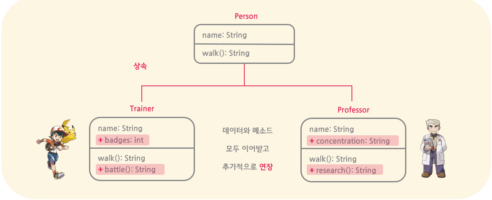

### 상속 (Inheritance)
기존의 클래스를 __연장하여 새로운 클래스를 유도하는 것__



- __상위 클래스__ (__super class__): 기존에 있는 클래스 (또는 parent class라고도 함)
- __하위 클래스__ (__sub class__): 상위 클래스를 연장하는 클래스 (또는 child class라고도 함)
    - 하위 클래스는 상위 클래스의 데이터와 메소드를 __모두 이어 받는다__
    - 하위클래스에 추가적으로 __변수와 메소드를 추가__ 함으로써 기존의 클래스를 __연장하여 사용__ 한다
- 상속을 통해 __코드를 재사용__ 하기 때문에 __소프트웨어의 생산성을 높일 수 있다__
```java
    // 상위 클래스: 사람 캐릭터       |   // 하위 클래스: 포켓몬 트레이너
    public class Person {            |   public class Trainer extends Person {
        private String name;         |       // name, walk()을 상속받음
        public String walk()    {    |       // 자신만의 변수와 함수를 추가하여 연장
            return "walking...";     |       private int badges; 
        }                            |       public String battle(Trainer other) {
    }                                |           return "challenges a battle!";
                                     |       }
                                     |   }
```
- cf) 자바 언어에서는 클래스의 다중 상속을 지원하지 않는다!

#### # 상속관계 vs 포함관계
- __상속관계__ (inheritance): 자식 클래스 `is-a` 부모 클래스의 일종 
- __포함관계__ (aggregation): 클래스 `has-a` 다른 클래스
```java
    public class Person {
        private String name;
    }
    // 상속관계 (is-a): 슈퍼 클래스의 연장   |  // 포함관계 (has-is): 다른 클래스를 소유
    public class Trainer extends Person {  |  public class room {
        private int badges;                |      private int roomNumber;
    }                                      |      private Person resident;
                                           |  }
```

#### # 상속의 접근 범위
상속을 받더라도 접근 지정자의 종류와 상속 관계인 두 클래스의 상대적인 위치에 따라, 자식 클래스가 부모 클래스의 데이터와 함수에 접근이 가능한지의 여부가 달라진다
- `public` & `protected`: __언제든 상속받아 접근 가능__
- `default`: 두 클래스가 __동일한 패키지에 존재할 경우에만__, 상속받아 접근 가능
- `private`: 절대 __접근 불가__ (상속의 의미가 크게 없음)
```java
    public class Super {
        public int publicVal;
        protected int protectedVal;
        default int defaultVal;
        private int privateVal;
    }
    public class Sub extends Super {
        void set() {
            publicVal = 1;
            protectedVal = 1;
            defaultVal = 2; // 다른 패키지면, 컴파일 오류
            privateVal = -1; // 무조건 컴파일 오류; getPrivateVal()을 통한 접근이 권장됨
        }
    }
```

#### # Super 레퍼런스 (`super`)
해당 객체의 __부모 클래스를 가르키는 레퍼런스__ 
- 자식 클래스에서 __부모 클래스의 데이터 또는 메소드에 접근__ 할 때 사용된다
- 주로 부모로부터 상속받은 메소드를 자식이 수정(__메소드 오버라이딩__)할 때, 부모 메소드를 코드를 재사용하는 경우에 사용된다. (나머지 메소드는 어차피 상속받았기 때문에 굳이 super로 접근할 필요가 없음)
```java
    public class Person {
        public Person(String name)          public String walk()
        {                                   {
            this.name = name;                   System.out.println("walking...");
        }                                   }
    ---------------------------------------------------------------------------------
    public class Trainer extends Person {   
        Trainer(String name, int badges)    public String walk() 
        {                                   { 
            // 슈퍼생성자 코드를 재사용           // 슈퍼클래스의 메소드 호출
            super(name);                        super.walk();
            this.badges = badges;               System.out.println("in the grass!");
        }                                    }
    }
```
- 단, 생성자 메소드는 상속되지 않기 때문에, __파라미터가 있는 부모 생성자를 기반으로 자식 생성자를 정의__ 하고자 할 때에도 사용되기도 한다
    - 기본적으로 모든 자식 생성자는 부모의 기본 생성자를 먼저 호출한 후,  자식 생성자를 호출하는 순서를 가진다 (만약 상위 생성자에 기본 생성자가 없다면, 컴파일 오류가 생김)

### 업캐스팅과 다운캐스팅
레퍼런스 타입과 실제 가르키는 객체
- __업캐스팅__ (__upcasting__): 슈퍼 클래스 레퍼런스가 서브 클래스 레퍼런스 가르키기
    - 단, 슈퍼 클래스 레퍼런스는 오로지 슈퍼 클래스에서 정의된 데이터와 함수들만 접근 가능 (서브 클래스에서 추가된 멤버들을 접근 불가능)
- __다운캐스팅__ (__downcasting__): 서브 클래스 레퍼런스가 슈퍼 클래스 레퍼런스 가르키기
```java
// 업캐스팅을 통해 자동으로 타입 변환이 이루어짐
Subclass c = new Superclass();
// 업캐스팅 되었던 것을 다시 강제로 되돌리기
Superclass p = (Superclass) c;
```
- 업캐스팅된 레퍼런스를 사용하면 메소드가 더 전형적인 형태의 객체를 메소드 인자로 받게끔 정의 가능 (컴파일 오류가 덜 남)
```java
```
- cf) `instanceof` 연산자: 레퍼런스가 가리키는 객체의 원래 타입을 식별하는데 사용 (true / false 반환)
```java
Person red = new Trainer();
if (red instanceof Person) System.out.println("red is a person");   // 출력
if (red instanceof Trainer) System.out.println("red is a pokemon trainer"); // 출력
if (red instanceof Professor) System.out.println("red is a professor"); // X
```