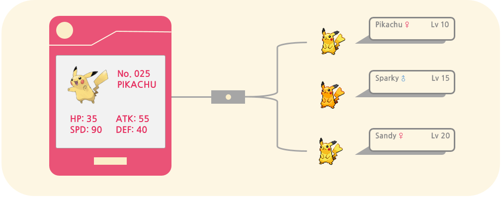

### 포켓몬 게임 설계하기
어떻게 실제에 근접하고 효율적인 객체들을 모듈화하는지 살펴보기
- 포켓몬: 151 종류의 포켓몬 정의하기
    - 후에 포켓몬을 쉽게 추가할 수 있게끔
    - 정의한 포켓몬 종류 < -> 실제 포켓몬 하나하나 (level, 경험치 설정...)
- 사람 캐릭터:
    - 트레이너, 박사, 악당, 그냥 사람 등...
- 배틀
- 진화시키기
- 아이템

#### # 클래스 사용하기



- 클래스-인스턴스 관계: 같은 구조를 가진 것을 __여러 종류 만들어야 할 때__ (같은 틀 사용)
```java
    public class Pokemon {
        private int id;
        private String name;
        private int hp, speed, attack, defense;
        public void display() {
            System.out.println(name);
        }
    }
    Pokemon pikachu = new Pokemon(25, "pikachu");
    Pokemon bulbasaur = new Pokemon(1, "bulbasaur");
    Pokemon charmander = new Pokemon(4, "charmander");
    Pokemon squirtle = new Pokemon(7, "squirtle");
```
- 상속관계: 슈퍼클래스를 __연장__ 하는데 의미가 있음: person -> trainer (+ battleOther()), professor (+ )
같은 틀을 사용하는 것으로 부족할 때
파생되는 종류들이 서로 너무 다르고, 다른 기능들을 구현해야 할 때