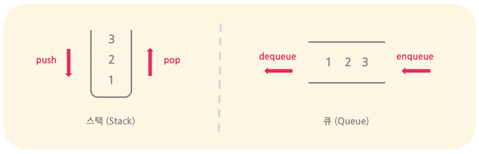

> 특정한 순서로 자료를 저장하는 스택과 큐 소개

### 스택과 큐
동일한 데이터 타입을 __특정한 순서__ 로 저장하는 자료구조들



- __특정한 순서__ 를 __기억해야 되는 경우__ 에 주로 사용된다.
    - 특히 __제일 최근에 저장__ 하거나 __마지막에 저장한 자료__ 에 접근하는데 매우 유용하다.
- __배열__ 또는 __연결 리스트__ 를 통해 구현이 가능하다.

### 스택 (Stack)
동일한 데이터 타입을 가장 최근 순서대로 (LIFO) 저장하는 자료구조
```cpp
// 스택 정의
class Stack {
    private:                    public:
        int* stackArr;              int top() {
        size_t size;                    return stackArr[size - 1];
        size_t capacity;            }
                                    void push(int data) {
                                        stackArr[size] = data;
                                        size++;
                                    }
                                    void pop() {
                                        size--;
                                    }
};
```
- __LIFO__ (Last in First Out): __가장 최근 순서__ 를 기억하는데 주로 사용된다
- 맨 위 __top__ 데이터 값만 삽입, 삭제, 접근 등의 __연산이 가능__ 하다: O(1)
    - 맨 위의 데이터에 대해 `push`, `pop`, `top` 연산이 가능하다.
    - 그 외의 데이터의 경우에는 위에서부터의 데이터를 차례대로 빼내어 따로 저장한 후 다시 삽입해주어야만 한다. 즉, 그 외의 데이터에 대한 연산은 탐색이 필요하므로 O(n)의 시간과 추가적인 공간이 필요하다.
- 호출 스택이 가득 찼는데도 불구하고 자료를 추가로 저장하기 위해 사용 가능한 공간 이상을 사용하려고 시도하는 경우를 __스택 오버플로우__ (__stack overflow__)라고 하며, 반대로 호출 스택이 비어있는데도 불구하고 접근하는 경우를 __스택 언더플로우__ (__stack underflow__)라 한다.
    - 스택 오버플로우는 무한 루프 또는 매우 깊은 재귀 함수 호출의 경우에 일어나며, 메모리에 잘못된 접근을 하는 오류로 인해 결국에는 프로그램의 충돌로 이어진다.

#### 스택은 어디에 사용되는가
스택은 가장 최근 순서를 기억하는데 효율적인 구조이기 때문에 다음과 같은 목적으로 주로 사용되고 있다.
1. __백트래킹__: 이전상태를 기록하고 다시 추적하여 되돌아가는데 사용
    - __호출 스택__ (__call stack__) 구현: 함수 호출 순서를 기록하여 함수가 종료되면 다시 이전 함수로 되돌아갈 수 있게끔 한다 (특히, 재귀함수를 사용할 때 유용)
    - __웹 브라우저 방문기록__: 웹 브라우저에서 이전 페이지로 돌아가거나 (__뒤로가기__), 다시 다음 페이지로 넘어가기 (앞으로 가기)
    - __실행취소__ (__undo__): 프로그램의 특정 실행 취소 또는 다시 실행 (redo)
    - __깊이 우선 탐색__ (__DFS__): 그래프를 깊이 우선으로 탐색할 때, 자식 노드 방문 이후 부모 노드로 되돌아와야 하기 때문에 부모 노드들 기록한다 (명시적으로 스택을 선언하거나 재귀함수를 통해 호출 스택을 사용할 수도 있다)
2. __수식 검사__ (__expression evaluation__): 수식에서 특정한 짝들을 맞추거나 대칭을 이루어지는지 검사하는데 사용
    - __짝 맞추기__ (ex. __괄호 체크__): 샌드위치와 같은 대칭을 이루는 식에서 특정 짝들을 맞추는데 유용하다
    - __계산기__: 전기, 중위, 후위표기법 수식 계산하기
3. __순서 바꾸기__: 간혹 주어진 것들의 순서를 특정한 방식으로 바꾸는데도 사용된다
    - __거꾸로 뒤집기__ (reverse), __후위표기법/전위표기법 변환__ 

### 큐 (Queue)
동일한 데이터 타입을 가장 오래된 순서대로 (FIFO) 저장하는 자료구조
```cpp
// 큐 정의
class Queue {
    private:                    public:
        int* queueArr;              int front() {
        int front, back;                return queueArr[front];
        size_t size                 }
        size_t capacity;            int back() {
                                        return queueArr[back];
                                    }
                                    void enqueue(int data) {
                                        stackArr[size] = data;
                                        size++;
                                    }
                                    void dequeue() {
                                        size--;
                                    }
};
```
- __FIFO__ (First in First Out): __가장 오래된 순서__ 를 기억하는데 주로 사용된다
- 맨 앞 __front__ 와 __back__ 데이터 값만 삽입, 삭제, 접근 등의 __연산이 가능__ 하다: O(1)
    - __맨 앞__ 의 데이터에 대해 `dequeue`과 `front` 연산이 가능하다.
    - __맨 뒤__ 의 데이터에 대해 `enqueue`과 `back` 연산이 가능하다.
    - 그 외의 데이터의 경우에는 스택과 마찬가지로 차례대로 빼내어 다시 저장한 후 다시 삽입해야 되어 O(n)의 시간과 추가적인 공간이 필요하다.

#### 큐는 어디에 사용되는가
큐는 __입력 순서대로 실행__ 하는데 효율적인 구조이기 때문에 우선순위가 같은 작업을 순서대로 실행하거나 우선순위 순서대로 작업을 실행하기 위해 대기열로 기록하여 사용하는 목적으로 사용된다.
- __작업 스케줄링__: CPU 스케줄링, 하드디스크 스케줄링, 인쇄 및 다른 IO 대기열, 웹 서버 요청 대기열 등 동일한 자원을 차례대로 분배하기 위해 사용된다
- __너비 우선 탐색__ (__BFS__): 그래프를 너비 우선으로 탐색할 때, 형제들을 차례대로 방문해야 하므로, 다음으로 방문해야 할 형제 노드들을 기록해 놓는다 (명시적으로 큐를 선언하여 사용한다)

#### 큐의 종류
- 선형 큐 (linear queue): 일반적으로 사용되는 시작과 끝이 분명한 큐
- 원형 큐 (circular queue): 원형 모양으로 이어져 시작과 끝이 없는 큐
- __우선순위 큐__ (priority queue): 우선순위가 높은 순서대로 정렬되는 큐

### (+) 덱 (Deque)
스택과 큐가 합쳐진 형태로 양 끝에서 자료를 넣고 뺄 수 있는 자료구조 (a.k.a double-ended queue)
- 맨 앞 __front__ 와 __back__ 데이터 값 모두 삽입, 삭제, 접근 등의 __연산이 가능__ 하다: O(1)
    - __맨 앞__ 의 데이터에 대해 `push_front`, `pop_front`, `front` 연산 가능하다.
    - __맨 뒤__ 의 데이터에 대해 `push_back`, `pop_back`, `back` 연산 가능하다.
    - 그 외의 데이터 연산의 경우에는 O(n)의 시간과 추가적인 공간이 필요하다.

### C++ STL: 스택, 큐, 덱
C++ 언어에서 구현된 스택, 큐, 그리고 덱 자료구조
```cpp
// STL 스택               // STL 큐                 // STL 덱
#include <stack>      |   #include <queue>      |   #include <deque>
using namespace std;  |   using namespace std;  |   using namespace std;
stack<int> s;         |   queue<int> q;         |   deque<int> d;
```
#### 연산 비교
| 연산 |스택 ( stack ) | 큐 ( queue ) | 덱 ( deque ) | 시간복잡도 |
|:---:|:---|:---|:---|:---:|
| __접근__ | s.top() | q.front(), q.back() | d.front(), d.back() | O(1) |
| __삽입__ | s.push() | q.push() | d.push_ front(), d.push_back() | O(1) |
| __삭제__ | s.pop() | q.pop() | d.pop_ front(), d.pop_back() | O(1) |
| __크기__ | s.size() | q.size() | d.size() | O(1) |
| __비었나?__ | s.empty() | q.empty() | d.empty() | O(1) |

### 주의사항
스택, 큐, 덱을 구현하거나 관련 문제를 푸는 경우에 주의해야 할 점들

#### 

#### 1. 스택
- top() 또는 pop() 전에 반드시 !empty() 임을 확인해야 한다. 아니면 seg fault 뜸
- 스택에서의 특정 value를 pop해야 되는 연산이 필요한 경우 (ex. max value pop), 배열 기반의 스택보다는 연결 리스트 기반으로 스택을 구현하는 것이 좋다

#### 2. 큐