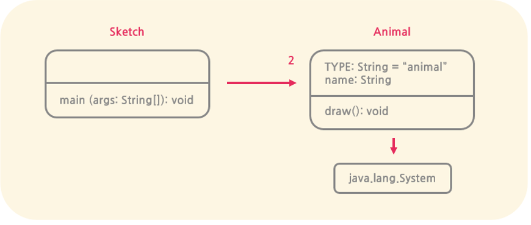

### UML 다이어그램 (Unified Modeling Language Diagram)
클래스나 객체 사이의 관계를 나타내는 도구
- UML 클래스 다이어그램 (클래스 그림): 클래스의 데이터 (attributes)와 연산 (methods)을 표현
    - 직선: 연관 관계(associations)을 표현
    - 직선화살표: 한 클래스가 다른 클래스를 사용하는 관계를 나타냄

#### 상속
관계는 상하 부모 <- 자식 으로 표현됨