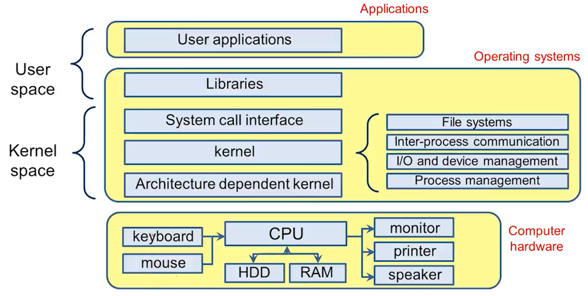

### 시스템 소프트웨어
사용자 또는 응용 프로그램의 요구에 따른 컴퓨터 하드웨어 자원의 제어 및 관리를 담당
- 좁은 의미에서 운영체제가 시스템 소프트웨어
| 컴퓨터 시스템 |
|:----:|
| __응용 프로그램 (Application)__ |
| __시스템 소프트웨어__: 운영체제, 언어처리기(컴파일러, 어셈블러), 유틸리티 프로그램 |
| __컴퓨터 하드웨어__: CPU, RAM, HDD, I/O 디바이스 |

linux: a multi-user OS for single-user machine