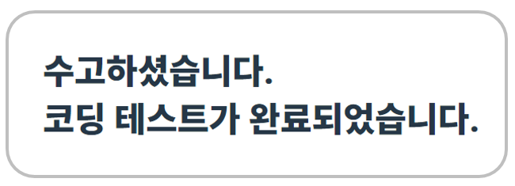

### 오늘의 커밋

#### 지원서에 대한 생각
> 이틀 전에 네이버, 라인, NHN 하반기 공채 또는 채용연계형 인턴에 각각 자소서 또는 지원서를 작성하여 제출했다. 사실 쓰기 전에는 정말 어떻게 써야할지와 잘 쓸 수 있을 지에 대해 고민이 많았었다. 그런데 걱정했던 것이 무색하게 막상 써보고 나니까 생각보다 별 거 아니라는 생각이 들었다. 나는 완벽한 사람도 아니고, 앞으로도 계속 배워야 할 것이 많기 때문에 지원서에서 나의 부족함이 들어날까봐 걱정하지 않아도 될 것 같다. 내가 부족하다고 느끼면 이번에는 합격을 못할 것이지만, 그렇다고 영워히 내가 이 상태에 머무르지는 않을테니까. 앞으로 계속 나는 나대로 성장해나가면 된다. 너무 누가 어떻게 생각할까, 내가 어떻게 부족하게 비춰질까에 대해 걱정할 필요 없이. 걱정한다고 해서 달라지지도 않으니까, 나는 그냥 여태껏 내가 그랬던 것처럼 꾸준히 바르게 나의 길을 가면 된다.

#### 카카오 블라인드 코딩테스트 2018 
> 며칠 전 카카오 블라인드 

#### 라인, 네이버 코딩테스트
>

### 오늘의 풀리퀘스트
- 