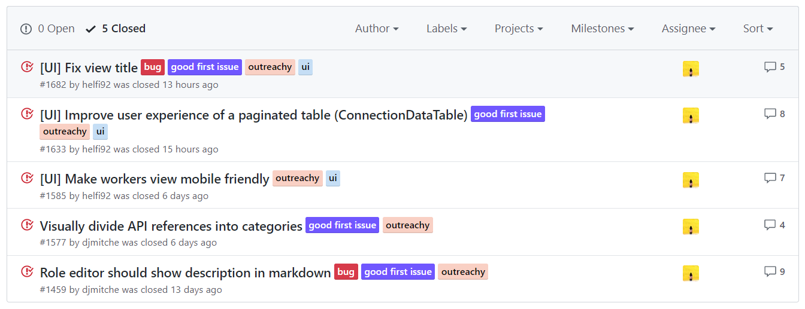
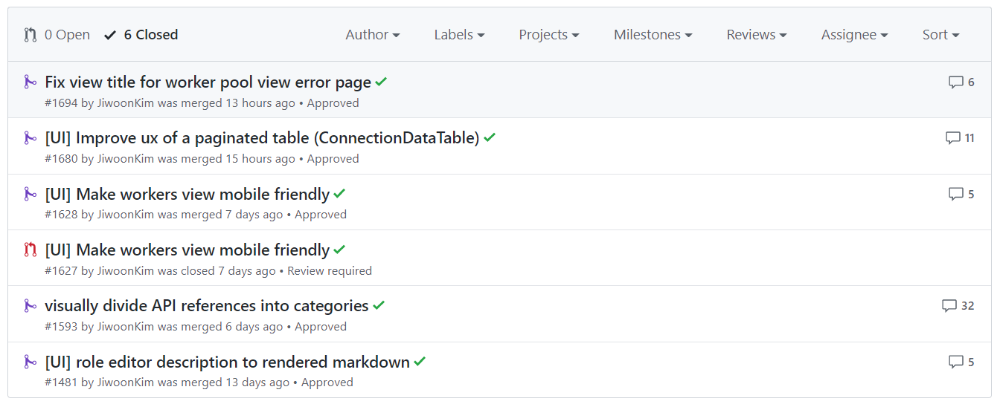
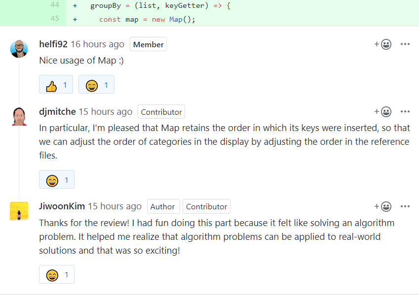
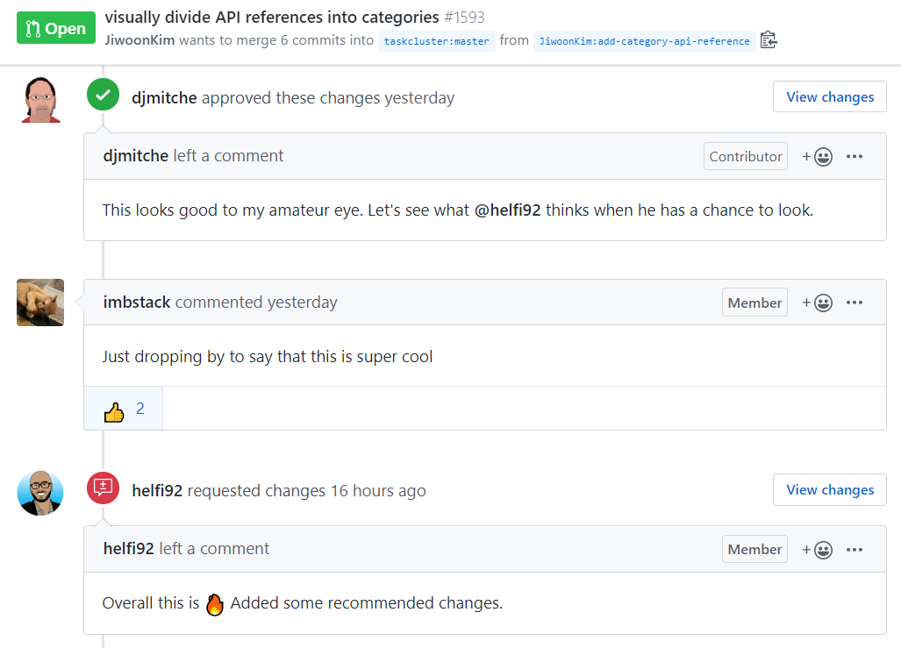

### 오늘의 커밋

#### 오픈 소스 프로젝트: 총 5개의 컨트리뷰션
> 근 2주간 원격 인턴십 프로그램인 Outreachy의 2차 과정인 컨트리뷰션 프로젝트에 빡세게 참여했다. 총 5개의 이슈를 해결하는 Pull Request를 제출하여 __실제 프로덕트 코드 베이스에 반영되어 굉장히 뿌듯했다__ .

- __해결한 이슈들__ (Issues)

- __풀리퀘스트들__ (Pull Requests)

> 밤낮으로 이슈를 살펴보고 버그들을 고치기 위해 비록 잠도 많이 자지 못했지만, 실제 프로덕트의 버그들을 고쳐보는 경험은 굉장히 의미가 있었다고 생각한다. 내가 작성한 코드들이 실제 프로덕트에 반영되는 것만큼 값진 경험은 없을 것이다. 그리고 무엇보다도 __이제 커다란 코드 베이스를 건드는 것에 대한 두려움이 없어졌다__ . '어떻게 하지?'라고 안절부절하며 불안에 떨 것 없이, 차근차근 무엇이 문제인지 찾고 또 거기서 어떻게 고쳐나갈지 여러가지 생각해보면 된다는 것을 경험했기 때문이다. 여러가지 해결방식 중에 어떤 방식이 가장 좋을 지 고민이 된다면 그건 또 시니어 엔지니어에게 물어보면 된다. 결국, 안 될 것은 없다! 거기다 좋은 깃 커밋 메세지를 작성하는 방법, 깃 리베이스 커맨드로 커밋들을 정리하는 방법, 그리고 풀리퀘스트를 작성하고 시니어 엔지니어들과 코드 리뷰를 하며 의미있는 코드를 작성하는 방법까지, 정말 여러가지로 많은 것을 배울 수 있었다. 정말 중요한 것들을 많이 배웠기 때문에 굉장히 의미 있는 시간들이었다고 생각한다.

#### 뿌듯했던 2번째 컨트리뷰션!
> 앞서 얘기한 오픈 소스 프로젝트 컨트리뷰션을 하던 중 가장 뿌듯했던 순간을 뽑으라고 하면 단연, 2번째 컨트리뷰션을 뽑을 것이다. 프로덕트의 다큐먼트 페이지에서 API들을 나열하고 있는데, 이를 카테고리별로 나누어서 표시하는 이슈였다. 자바스크립트의 자료구조인 Map을 이용하여 API들을 카테고리별로 나누고 이를 UI에 표시하는 코드를 추가하여 풀리퀘스트를 제출했더니 __시니어 엔지니어 분들의 반응이 좋아서 굉장히 뿌듯했다__ . 또 카테고리별로 분류하는 알고리즘 문제마냥, 뭔가 알고리즘 공부를 하면서 배웠던 것들을 적용해 볼 수 있어서 굉장히 재미있기도 했다.

> 거기다 지나가는 다른 시니어 엔지니어 분께서도 (정말 뜬금없게도) 되게 좋다고 칭찬하고 가셔서 너무 뿌듯했다는..!

#### 깃허브 이슈 & 풀리퀘스트 작성방식
> 이번에 여러 이슈들을 해결하고 풀리퀘스트들을 작성하며 배웠던 몇 가지를 정리해보자면,

- __이슈 작성__: 
    1. `Describe the bug`: 어떤 버그인지 간략 설명
    2. `To Reproduce`: 어떻게 하면 버그를 살필 수 있는지, 어떤 상황에서 발생하는지 추가 설명
    3. `Expected behavior`: 어떤 결과를 목표로 버그를 고쳐야 하는지 설명
    4. (필요 시) `Screenshots`: 필요할 경우 사진도 추가하여 설명

- __풀리퀘스트 작성__: 
    1. `Closes {#이슈 번호}`: 어떤 이슈를 해결하는지 명시 + 이슈에 대한 간략 설명
    2. `Changed applied`: 해결 방식 설명
    3. (필요 시) `Results`: 필요할 경우 비포 앤 애프터 사진도 추가

### 오늘의 풀리퀘스트
- 오픈 소스 프로젝트 기여를 통해 커다란 코드 베이스에서 코딩하는 것에 대한 두려움이 사라졌다!
- 오픈 소스 프로젝트 기여를 하면 __코드 리뷰__ 를 받을 수 있어 굉장히 유용하다
- 이슈 또는 풀리퀘스트를 형식에 따라 작성하면 굉장히 좋다