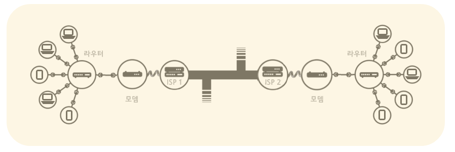
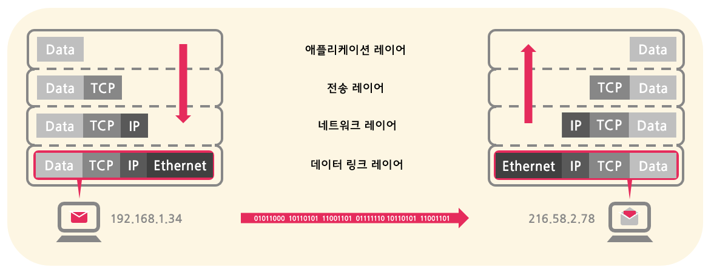
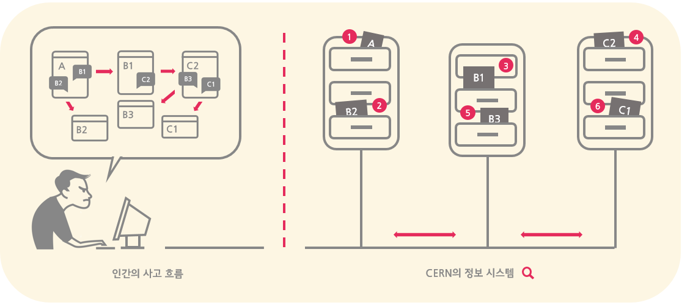

### 인터넷과 웹
인터넷과 웹은 자주 혼용되어 사용되곤 하지만, 사실 둘은 엄연히 다른 개념이다.

- 인터넷은 전세계의 컴퓨터들이 통신을 위해 연결된 __거대한 네트워크 구조물__ 이라고 할 수 있으며,
- 웹은 __그 구조물을 기반으로__ 컴퓨터들이 서로 하이퍼텍스트 및 다양한 리소스를 주고받는 __서비스__ 이다.

### 인터넷 (Internet)
인터넷은 `inter + net` 라는 사전적 정의 그대로, 수없이 많은 컴퓨터 네크워크들이 서로 연결된 커다란 네트워크이다. 한 컴퓨터와 다른 컴퓨터가 연결되고, 점차 많은 컴퓨터들이 서로 연결되면서 네트워크를 형성하고, 이렇게 개인 또는 대학 및 연구기관, 그리고 정부 등 사설 또는 공공 목적의 각각 독립된 네트워크들이 서로 이어진 것이 인터넷이다. 즉, 인터넷은 다양한 __네트워크들의 네트워크__ 라고도 할 수 있다. 

#### 왜 필요한가
인터넷은 서로 다른 컴퓨터 간에 __정보 리소스 및 서비스를 공유하기 위해__ 필요하다. 즉, 한 컴퓨터에서 다른 컴퓨터로 데이터가 전송될 수 있는 길이 필요한데, 인터넷이 바로 그 도로 역할을 하는 구조물인 것이다. 구체적으로, 다음과 같은 정보 리소스 및 서비스를 주고받는데 사용된다:
- 전자 우편 (electronic mail; e-mail)
- 원격 컴퓨터 연결 (telnet)
- 파일 공유 및 전송 (FTP)
- 하이퍼텍스트 문서 공유 (inter-linked hypertext documents)
- 웹 리소스 전송 (World Wide Web)

이 중 특히, 웹이 가장 널리 사용되고 있기 때문에 인터넷은 웹과 자주 섞어 사용된다.

#### 어떻게 생겼나 (생김새 알아보기)
인터넷은 추상적으로 하늘에 있는 구름으로 흔히 표현되곤 하지만, 실제로는 물리적인 와이어로 구성되어 있다.

- 각각의 컴퓨터는 통신을 위해 __물리적인 Ethernet 케이블__ 또는 __무선인 WiFi / 블루투스 시스템__ 으로 서로 연결된다.
- 모든 컴퓨터가 각기 다른 컴퓨터에 일일이 연결되는 방식은 비효율적이므로, 중간에 __라우터__ 를 도입하여 __중앙에서 교통정리__ 를 하게끔 한다.
- 수없이 많은 컴퓨터들을 연결하기 위해 __다수의 라우터__ 를 사용하여 컴퓨터와 라우터뿐만 아니라, __라우터와 라우터 간에도 연결__ 을 하여 하나의 큰 네트워크를 구성한다.
- 네트워크를 __ISP 와 연결__ 함으로써 또 다른 네트워크와 연결시킨다.
    - __ISP__ 는 이미 존재하는 __유선 전화 통신망을 이용__ 하여 서로 다른 네트워크 간에 통신을 할 수 있게끔 DNS와 NAP 등의 서버를 통해 서비스를 제공하는 회사이며, 유선 전화 통신망을 이용하기 위해서는 __모뎀__ 을 사용하여 디지털 신호를 아날로그 신호로, 또는 그 거꾸로 변환한다.
    - 오늘날 대부분의 컴퓨터 및 디바이스는 ISP가 제공하는 서비스를 이용하여 인터넷을 제공받고 있다. 
        
결국, 인터넷은 대부분이 __유선으로 연결되어 있는 물리적인 그물망__ 이라고 할 수 있다.

#### 정보는 어떻게 전송되는가 (TCP/IP)
앞서 얘기했듯이, 인터넷은 서로 다른 컴퓨터들을 연결하는 도로와 같다. 그리고 데이터는 이 인터넷이라는 도로를 통해 한 디바이스에서 다른 디바이스로 이동한다. 하지만 모든 도로에 교통질서가 있듯이, 데이터가 인터넷 도로 위에서 이동하는데도 __정해진 일련의 절차와 규칙들을 따라야__ 만 한다.

1. 일단 먼저, 전달하고자 하는 데이터를 보내기 알맞은 작은 단위들로 나누어 쪼갠다. 이렇게 나누어진 데이터 단위를 __패킷(packet)__ 이라고 한다.
2. 그 다음, 최종 목적지인 디바이스와 애플리케이션의 __주소지__ 를 나타내는 __IP 주소__ 와 __포트번호__ 를 전달할 패킷에 첨부해야 한다. 편지에 우표를 붙이듯이, 패킷에 헤더(header) 데이터를 붙인다고 생각하면 된다. 
    - __IP 주소__ 는 목적지 디바이스를 가르키고, __포트번호__ 는 해당 디바이스 내에서 데이터가 전달되어야 할 최종 프로그램 또는 애플리케이션을 가르킨다.
- 보낼 준비가 완료된 패킷은 비트(bits) 단위이기 때문에 __아날로그 신호로 변환__ 되어 유선 또는 무선을 통해 보내진다.
- 첨부된 IP 주소를 바탕으로 패킷이 여러 __라우터 및 서버를 거쳐__ 목적지 디바이스에 전달된다.
- 전달된 아날로그 신호를 __다시 비트 단위의 데이터로 변환__ 한 후, 주소지를 비롯한 __헤더 정보를 하나씩 떼내고__ 마지막으로 남은 데이터를 첨부된 __포토번호의 애플리케이션에 전달__ 하면, 길고 길었던 데이터의 전송 과정이 끝난다.

이러한 절차들을 모아 __TCP/IP 프로토콜__ 이라고 부르며, 위에서 설명한 절차들 이외에도 나누어진 패킷이 다시 원래의 데이터로 합쳐지는 과정, 중간에 패킷 하나가 분실되면 패킷을 재전송하는 등의 규칙들도 포함되어 있다. 전송하고자 하는 데이터가 목적지 디바이스에 반드시 도착하게끔 __신뢰성을 보장__ 하기 때문에, TCP/IP는 다른 말로 __Internet Protocol Suite__ 라고도 불리며 인터넷에서 가장 일반적으로 사용되는 규칙들로 자리를 잡고 있다. 

그 외에 스트리밍과 같이 전송의 완료성보다는 실시간 속도가 더 중요한 애플리케이션의 경우에는 TCP 대신 UDP 규칙들을 사용하기도 한다. 

#### cf ) 설계 속의 철학
> The internet is more than mere hardware but actually a __design philosophy__ and an __architecture expressed in a set of protocols__. - 인터넷의 아버지 중 하나인 빈트 세르프 (Vint G. Cerf)

개인적으로 인터넷의 진정 위대한 점은 그 설계 속에 담긴 철학에 있다고 생각한다. 

인터넷은 핵 폭탄이 터져도 정보가 무사히 전달될 수 있도록 __분산적인 형태__ 로 설계되었다. 즉, 중앙에서 하나의 컴퓨터가 모든 연결을 통제하기보다는, 네트워크를 이루는 수없이 많은 컴퓨터와 통신 장치들이 각자 일종의 전화국 역할을 하는 분산적 패킷 교환망인 것이다. 이로 인해, 만일 핵폭탄으로 경로 하나가 사라지더라도, 또 다른 경로를 통해 데이터 패킷이 최종 목적지에 무사히 전달된다. 
- 이러한 설계로 인해 인터넷 그 누구에 의해서도 지배되지 않는, 또는 모두가 제어하는 시스템으로 존재한다 (__" no one is in control of it, or everyone is in control of it. "__)
- 나아가, 단순히 하드웨어적인 작동 메커니즘보다는 설계 철학으로서 자리를 잡고 있기 때문에 새로운 통신 기술을 쉽게 도입할 수 있는 유연성을 가지고 있기도 하다. 신기술을 적용하는데 단순히 인터넷의 프로토콜에 따르기만 하면 되기 때문에 인터넷은 끊임없이 __새로운 기술을 흡수하며 계속 발전__ 하고 앞으로도 발전할 것이다.

비유하자면, 한 곳에서 다른 곳으로 이동하는데 있어서 시멘트로 도로를 건설하는 과정보다는 도로 교통법을 아는 것이 더 중요하듯이, 인터넷을 통해 데이터를 전송하는데 있어서도 하드웨어적인 측면보다는 __어떤 프로토콜과 철학에 의해 작동하는지__ 를 이해하는 것이 더 중요한 것이다.  

### 월드 와이드 웹
초반에 우리는 웹이 인터넷이라는 통신망을 이용하여 컴퓨터들이 정보를 주고받는 어떤 특정한 __서비스__ 라고 설명했었다. 아마 웹의 정의에 대해 검색해보면, 여기에 살을 조금 붙여서 '웹 브라우저 프로그램이 있는 컴퓨터가 서버 컴퓨터에게 HTML을 비롯한 다양한 파일 및 데이터를 요청하고 받는 서비스'라는 설명이 가장 많이 나올 것이다. 우리는 오늘 여기서 조금 더 나아가, 
- 웹이 수많은 파일 종류 중에서도 왜 하필이면 HTML 파일을 주고받기 시작하였는가?
- 어떤 방식을 통해 한 컴퓨터에서 다른 컴퓨터로 HTML 파일을 주고받는가? (서비스의 작동방식)
- 왜 웹(web)이라고 불리고 우리 사회에 어떤 변화를 불러왔는가?

에 대한 질문들을 자세히 살펴봄으로써, 월드 와이드 웹 (World Wide Web, WWW)이 더 구체적으로는 __하이퍼링크를 통해 전세계의 컴퓨터에 있는 정보를 거미줄과 같이 서로 연결시킨 정보 시스템__ 이라는 더 깊은 이해까지 이끌어내보고자 한다.

#### 왜 하필 HTML을 주고받는가
현재 우리는 웹을 통해 문서, 이미지, 영상 등 다양한 정보를 교환하고 있지만, 초기 웹의 형태는 단순히 HTML이라는 문서만을 교환하는 형태였다. 그런데 왜 하필이면 HTML을 사용하여 정보를 교환하였을까? 이 이유를 찾기 위해 우리는 여기서 조금의 역사적인 상상력을 발휘하여, 웹의 아버지인 팀 버너스 리(Tim Berners-Lee)가 당시 어떠한 고민을 하였는지를 살펴보고자 한다.

모든 발명품이 특정한 문제로부터 시작하였듯이, 월드 와이드 웹도 당시 팀이 가지고 있던 어떤 불만에서부터 출발했다. 당시 CERN이라는 연구소에서 일하고 있던 그는 연구소 내에서 정보를 찾는 방식에 대해 큰 문제의식을 느끼고 있었다. 그 당시에 연구소 내에서 정보는 수많은 컴퓨터들에 각각 분산되어 계층적인 폴더 구조에 저장되는 방식이었는데, 이 방식이 __원하는 정보를 찾는데 있어 굉장히 불편 했기 때문__ 이다.

예를 들기 위해, 위에 소개된 그림처럼 팀이 __`문서 A를 읽는 과정`__ 을 자세히 살펴보자. 
1. __`문서 A`__ 를 읽는 와중에 __`단어 B2`__ 를 처음 보게 되어 B2와 __관련된 문서를 찾아__ 읽는다.
2. 다시 문서 A로 돌아와 읽다가 __`B1 실험 결과`__ 가 문서 A의 내용과 긴밀한 관련이 있음을 깨닫게 되어, B1 실험과 __관련된 문서를 찾아__ 실험 결과를 확인한다.
3. 그러다 문득, 왜 하필이면 __`C2 이론`__ 을 B1 실험에 적용하였는지가 궁금해져, __또 관련 문서를 찾아__ 읽는다.
4. C2 이론 문서를 읽으면서 깊이 감명을 받아 이를 쓴 __`연구원 B3`__ 와 그의 다른 __`이론 C1`__ 에 대해 더 자세히 알고자 각각 관련된 문서를 찾아 또 읽는다.
5. __다시 처음의 `문서 A` 로 돌아와__ 마저 읽는다.

이처럼 사람은 연상을 통해 사고가 자연스럽게 하나에서 또 다른 것으로 즉시 이어지는데 반해, 당시 CERN의 정보 시스템은 순차적이고 계층적인 구조였기 때문에 __파일을 찾는데 많은 시간이 걸려 굉장히 비효율적__ 이었다.당시 CERN의 정보 시스템에서는 하나의 파일을 찾기 위해 어느 컴퓨터에 관련 내용이 저장되어있는지부터, 해당 컴퓨터 시스템 내의 어느 폴더에 파일이 위치했는지까지도 일일이 찾아야만 했는데, 위의 예시처럼 문서 A 하나만을 읽는데도 추가로 5 문서가 더 필요한 경우에는 정말 오랜 시간이 걸릴 수 밖에 없었다. 즉, 당시 CERN의 정보 시스템은 __연상적으로 정보를 참조하기에 적절하지 않았던 것__ 이다.

이러한 이유로 팀은 사람의 자연스러운 연상 과정을 따라 정보를 체계화하는 __새로운 정보 시스템이 필요__ 하다고 주장하며,
- 각 정보마다 고유한 주소인 __URL__ 을 표시,
- 표시된 주소로 바로 해당 정보에 접근할 수 있는 __하이퍼링크 (Hyperlink)__ 개념을 도입,
- 하이퍼링크를 문서파일에 삽입할 수 있는 __HTML (Hypertext Markup Language)__ 이라는 언어를 창조,
- HTML로 쓰여진 하이퍼텍스트 파일을 주고 받을 수 있는 전송 양식인 __HTTP (Hypertext Transfer Protocol)__ 를 정의하고

이 모두를 합침으로써, 연상적으로 정보를 참조할 수 있는 정보 시스템인 __월드 와이드 웹 (World Wide Web)__ 을 만들게 되었던 것이다.

#### 왜 웹 (web)이라고 불리는가

월드 와이드 웹 (World Wide Web; WWW)은 
인터넷을 기반으로 서로 다른 컴퓨터들 간에 하이퍼텍스트를 공유함으로써 웹이란 링크를 통해 정보 검색을 용이하게 하는 시스템이자 검색 서비스

하이퍼텍스트 형식으로 표현된 다양한 정보를 효과적으로 검색하는 시스템/서비스. 하이퍼텍스트를 이용하여 다양한 정보를 교환하느 전송방식. 하이퍼텍스트로 묶인 컨텐츠의 집합

 하이퍼링크들을 통해 다양한 정보를 서로 연결시켜 마치 거미줄처럼 엮음으로써 더욱 효율적으로 정보를 찾을 수 있는 방법이 제공

#### 정보의 거미줄: 하이퍼텍스트

 하이퍼텍스트는 사용자가 연상하는 순서에 따라 원하는 정보를 얻을 수 있는 시스템이다

컴퓨터를 통하여 저장된 정보를 학습자가 자신의 필요와 관심 및 인지 스타일에 따라 자유롭게 검색하도록 도와주는 비순차적 텍스트의 전개원리.

associative indexing

wanted the Memex to support the building of trails through the material in the form of a set of links that would combine information of relevance for a specific perspective on a specific topic.

Hypertext was important because it presented two fundamental changes in the storage and retrieval of data. The first was the capability to move rapidly from one part of a document to another by means of an associative link. The sequential pattern of reading so familiar from the print world was replaced by a truly interactive format.

웹은 근본적으로 하이퍼링크 (=text & images you can clikc to jump to other pages)
이러한 하이퍼링크로 상호 연결된 정보의 거대한 웹(거미줄)을 형성하는데, 여기서 웹이란 단어가 생겨난것
하이퍼링크가 존재하기 이전에는 컴퓨터에서 다른 정보로 이동하기 위해서는 (파일을 여는 거라고 해도 되나?) 파일 시스템을 뒤지거나 검색 상자에 입력하여 찾아야만 했다.
하이퍼링크를 사용하면 하나의 주제에서 다른 주제로 쉽게 이동할 수가 있게 되었다. 

웹 리소스의 기본인 HTML
서로 이어지는 데이터 문서를 공
fundamental single page of hyperlink document (= hypertext)
hypertext is stored in plain text (ex. ascii, unicode)
    - need to distinguish hypertext <-> plain text: html 탄생

HTML, CSS, JavaScript 등의 파일들과 그 외의 데이터 형식들을 전송하는데 사용된다.

#### 웹 리소스는 어떻게 전송되는가
client and server relationship, http protocol, on top of tcp/ip, url -> dns server (이 부분은 사실 internet 부분임 tcp/ip부분)

Clients are the typical web user's internet-connected devices (for example, your computer connected to your Wi-Fi, or your phone connected to your mobile network) and web-accessing software available on those devices (usually a web browser like Firefox or Chrome).
Servers are computers that store webpages, sites, or apps. When a client device wants to access a webpage, a copy of the webpage is downloaded from the server onto the client machine to be displayed in the user's web browser.

음식 먹으로 가는 길, 도로 = 인터넷
식당 = 서버
주문 = request
http = 주문하고 음식을 받는 절차

hyperlink하는 document의 주소 = url
after find resource server address, ask for web resource (= http)
hypertext가 담긴 파일 = html
이 html을 볼 수 있는 것이 web browser (=application to request web resource from servers and render html)
점점 웹 리소스가 만들어지면서 찾고자 하는 리소스를 찾기가 어려워짐 그래서 서치 엔진이 만들어짐 (= web crawler + index page + search algorithm(단어 입력->관련index소개))
net neutrality (= principle that all packets on the internet should be treated equally-the same speed and priority) but company들은 자기 data가 더 priority로 제공하고 싶을 수 있다 (isps could be gate keepers to content w/ strong incentives to not play nicely to competitors)

- [demonstration](https://www.eventedmind.com/classes/how-the-web-works-7f40254c/introduction-how-the-web-works-fd9f78b1)
- __client and server relationship__
    1. when web address is typed into browser, client computer asks DNS server for the real address (the IP address)
        - url = uniform resource locator; the address of a specific website or file on the Internet
        - dissecting a url: [infographic](https://www.helloitsliam.com/2014/12/20/how-the-internet-works-infographic/): use the Web (http://) to find a host server names 'www' in the 'google.com' network, and look in the 'search' folder so I can pull out a particular file.
    2. receiving the IP address, the browser then sends an HTTP request message to the server at the address for a copy of the website
        - the message is written in HTTP (the language defined to use between clients and servers)
        - the message is sent by accross the internet connection following the __TCP/IP__ rules (go to address in form of IP and ensure data packages are successfully received bt TCP rules)
    3. server responds to client's request by sending a message with a status code (ex. 200 OK)
        - if the request is approved (200 OK), the server sends the website's component files (code files of HTML, CSS, JS + assets for images, music, video, documents, pdfs) in a series of data packages
    4. finally, the client receives the component files and the browser assembles them into a complete website and displays it

    https://asfirstalways.tistory.com/297 참고하자

참조

[MDN - How networks are created and became the Internet](https://developer.mozilla.org/en-US/docs/Learn/Common_questions/How_does_the_Internet_work)

[Khan Academy - How the Internet works (video series)](https://www.khanacademy.org/partner-content/code-org/internet-works)

[Infographic of how the Internet works](https://www.helloitsliam.com/2014/12/20/how-the-internet-works-infographic/)

[Stanford Paper - How the Internet works Protocol-wise](http://web.stanford.edu/class/msande91si/www-spr04/readings/week1/InternetWhitepaper.htm)

[Youtube Crash Course: The Internet (great overview video)](https://www.youtube.com/watch?v=AEaKrq3SpW8&list=PL8dPuuaLjXtNlUrzyH5r6jN9ulIgZBpdo&index=30)

[MDN - How the Web works](https://developer.mozilla.org/en-US/docs/Learn/Getting_started_with_the_web/How_the_Web_works)

[생활코딩 - 원시웹 (인터넷과 웹의 탄생과정)](https://opentutorials.org/course/3084/18889)

[Youtube Crash Course: The World Wide Web](https://www.youtube.com/watch?v=guvsH5OFizE&list=PL8dPuuaLjXtNlUrzyH5r6jN9ulIgZBpdo&index=31)

[Wikipedia - World Wide Web](https://en.wikipedia.org/wiki/World_Wide_Web)

[Ted-Ed - What is the World Wide Web](https://www.youtube.com/watch?v=J8hzJxb0rpc)

[Tim Berners-Lee - Information Management: A Proposal](https://www.w3.org/History/1989/proposal.html)

[Wikipedia - Hypertext](https://en.wikipedia.org/wiki/Hypertext)

[History of Hypertext](https://www.nngroup.com/articles/hypertext-history/)

[두산백과 - 하이퍼텍스트](https://terms.naver.com/entry.nhn?docId=1200583&cid=40942&categoryId=32828)