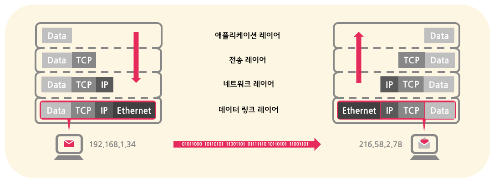

### 인터넷과 웹
인터넷과 웹은 자주 혼용되어 사용되곤 하지만, 사실 둘은 엄연히 다른 개념이다.

- 인터넷은 전세계의 컴퓨터들이 통신을 위해 연결된 __거대한 네트워크 구조물__ 이라고 할 수 있으며,
- 웹은 __그 구조물을 기반으로__ 컴퓨터들이 서로 특정한 정보를 특정한 방식으로 주고받는 __특정한 서비스__ 이다.

### 인터넷 (Internet)
인터넷은 `inter + net` 라는 사전적 정의 그대로, 수없이 많은 컴퓨터 네크워크들이 서로 연결된 커다란 네트워크이다. 개인 또는 대학 및 연구기관, 그리고 정부 등 사설 또는 공공 목적의 각각 독립된 네트워크들이 서로 이어짐으로써 만들어졌기 때문에 다양한 __네트워크들의 네트워크__ 라고도 할 수 있다. 

#### 왜 필요한가
인터넷은 서로 다른 컴퓨터 간에 __정보 리소스 및 서비스를 공유하기 위해__ 필요하다. 구체적으로, 다음과 같은 정보 리소스 및 서비스를 주고받는데 사용된다:
- 전자 우편 (electronic mail; e-mail)
- 원격 컴퓨터 연결 (telnet)
- 파일 공유 및 전송 (FTP)
- 하이퍼텍스트 문서 공유 (inter-linked hypertext documents)
- 웹 리소스 전송 (World Wide Web)

이 중 특히, 웹이 가장 널리 사용되고 있기 때문에 인터넷은 웹과 자주 섞어 사용된다.

#### 어떻게 생겼나 (생김새 알아보기)
인터넷은 추상적으로 하늘에 있는 구름으로 흔히 표현되곤 하지만, 실제로는 물리적인 와이어로 구성되어 있다.

- 각각의 컴퓨터는 통신을 위해 __물리적인 Ethernet 케이블__ 또는 __무선인 WiFi / 블루투스 시스템__ 으로 서로 연결된다.
- 모든 컴퓨터가 각기 다른 컴퓨터에 일일이 연결되는 방식은 비효율적이므로 대신, __라우터__ 를 도입하여 __중앙에서 교통정리__ 를 하게끔 한다.
- 수없이 많은 컴퓨터들을 연결하기 위해 __다수의 라우터__ 를 사용하여 컴퓨터와 라우터뿐만 아니라, __라우터와 라우터 간에도 연결__ 을 하여 하나의 큰 네트워크를 구성한다.
- 하나의 네트워크를 __ISP 와 연결__ 함으로써 또 다른 네트워크와 연결시킨다.
    - __ISP__ 는 이미 존재하는 __유선 전화 통신망을 이용__ 하여 서로 다른 네트워크 간에 통신을 할 수 있게끔 DNS와 NAP 등의 서버를 통해 서비스를 제공하는 회사이다.
    - 유선 전화 통신망을 이용하기 위해 __모뎀__ 을 사용하여 디지털 신호를 아날로그 신호로, 또는 그 거꾸로 변환할 수 있게 한다.
- 오늘날 대부분의 컴퓨터 및 디바이스는 ISP가 제공하는 서비스를 이용하여 인터넷을 제공받고 있다. 
        
결국, 인터넷은 __유선으로 연결되어 있는 물리적인 그물망__ 이라고 할 수 있다.

#### 정보는 어떻게 전송되는가 (TCP/IP)
앞서 얘기했듯이, 인터넷은 서로 다른 컴퓨터들을 연결하는 도로와 같다. 그리고 데이터는 이 인터넷이라는 도로를 통해 한 디바이스에서 다른 디바이스로 이동한다. 하지만 모든 도로에 교통질서가 있듯이, 데이터가 인터넷 도로 위에서 이동하는데도 __정해진 일련의 절차와 규칙들을 따라야__ 만 한다.

- 일단 먼저, 전달하고자 하는 데이터를 보내기 알맞은 작은 단위들로 나누어 쪼갠다. 이렇게 나누어진 데이터 단위를 __패킷(packet)__ 이라고 한다.
- 그 다음, 최종 목적지인 디바이스와 애플리케이션의 __주소지__ 를 나타내는 __IP 주소__ 와 __포트번호__ 를 전달할 패킷에 첨부해야 한다. 편지에 우표를 붙이듯이, 패킷에 헤더(header) 데이터를 붙인다고 생각하면 된다. 
    - __IP 주소__ 는 목적지 디바이스를 가르키고, __포트번호__ 는 해당 디바이스 내에서 데이터가 전달되어야 할 최종 프로그램 또는 애플리케이션을 가르킨다.
- 보낼 준비가 완료된 패킷은 비트(bits) 단위이기 때문에 __아날로그 신호로 변환__ 되어 유선 또는 무선을 통해 보내진다.
- 첨부된 IP 주소를 바탕으로 패킷이 여러 __라우터 및 서버를 거쳐__ 목적지 디바이스에 전달된다.
- 전달된 아날로그 신호를 __다시 비트 단위의 데이터로 변환__ 한 후, 주소지를 비롯한 __헤더 정보를 하나씩 떼내고__ 마지막으로 남은 데이터를 첨부된 __포토번호의 애플리케이션에 전달__ 하면, 길고 길었던 데이터의 전송 과정이 끝난다.

이러한 절차들을 모아 __TCP/IP 프로토콜__ 이라고 부르며, 위에서 설명한 절차들 이외에도 나누어진 패킷이 다시 원래의 데이터로 합쳐지는 과정, 중간에 패킷 하나가 분실되면 패킷을 재전송하는 등의 규칙들도 포함되어 있다.

#### 설계 속의 철학
> The internet is more than mere hardware but actually a __design philosophy__ and an __architecture expressed in a set of protocols__. - 인터넷의 아버지 중 하나인 빈트 세르프 (Vint G. Cerf)

개인적으로 인터넷의 진정 위대한 점은 그 설계 속에 담긴 철학에 있다고 생각한다. 인터넷은 핵 폭탄이 터져도 정보가 전달될 수 있도록 __분산적인 패킷 교환망__ 의 형태로 설계되었다. 즉, 경로 하나가 사라진다하더라도 다른 경로를 통해 패킷이 최종 목적지에 전달될 수 있는 네트워크인 것이다.
- 이러한 설계로 인해 인터넷 그 누구에 의해서도 지배하지 않는, 또는 모두가 제어하는 시스템으로 존재한다 (__no one is in control of it, or everyone is in control of it__)
- 나아가, 단순히 하드웨어적인 작동 메커니즘보다는 설계 철학으로서 자리를 잡고 있기 때문에 새로운 통신 기술을 쉽게 도입할 수 있는 유연함을 가지고 있기도 하다. 신기술을 적용하는데 단순히 인터넷의 프로토콜에 따르기만 하면 되기 때문에 인터넷은 끊임없이 __새로운 기술을 흡수하며 계속 발전__ 해 올 수 있었다.

### Web (World Wide Web)
- a way of accessing information resources, specifically component files to constitute web pages, via the Internet

#### how the web works
- [demonstration](https://www.eventedmind.com/classes/how-the-web-works-7f40254c/introduction-how-the-web-works-fd9f78b1)
- __client and server relationship__
    1. when web address is typed into browser, client computer asks DNS server for the real address (the IP address)
        - url = uniform resource locator; the address of a specific website or file on the Internet
        - dissecting a url: [infographic](https://www.helloitsliam.com/2014/12/20/how-the-internet-works-infographic/): use the Web (http://) to find a host server names 'www' in the 'google.com' network, and look in the 'search' folder so I can pull out a particular file.
    2. receiving the IP address, the browser then sends an HTTP request message to the server at the address for a copy of the website
        - the message is written in HTTP (the language defined to use between clients and servers)
        - the message is sent by accross the internet connection following the __TCP/IP__ rules (go to address in form of IP and ensure data packages are successfully received bt TCP rules)
    3. server responds to client's request by sending a message with a status code (ex. 200 OK)
        - if the request is approved (200 OK), the server sends the website's component files (code files of HTML, CSS, JS + assets for images, music, video, documents, pdfs) in a series of data packages
    4. finally, the client receives the component files and the browser assembles them into a complete website and displays it

    https://asfirstalways.tistory.com/297 참고하자

참고자료

[인터넷이 어떻게 연결되는가](https://developer.mozilla.org/en-US/docs/Learn/Common_questions/How_does_the_Internet_work)

[인터넷의 작동방식의 이모저모 영상 시리즈](https://www.khanacademy.org/partner-content/code-org/internet-works)

[인터넷을 통해 정보는 어떻게 전달되는지 인포그래픽](https://www.helloitsliam.com/2014/12/20/how-the-internet-works-infographic/)

[TCP/IP 프로토콜로 설명한 인터넷의 작동방식](http://web.stanford.edu/class/msande91si/www-spr04/readings/week1/InternetWhitepaper.htm)

[데이터가 인터넷에서 전달되는 방식과 과정 영상](https://www.youtube.com/watch?v=AEaKrq3SpW8&list=PL8dPuuaLjXtNlUrzyH5r6jN9ulIgZBpdo&index=30)

[웹은 어떻게 작동하는가](https://developer.mozilla.org/en-US/docs/Learn/Getting_started_with_the_web/How_the_Web_works)