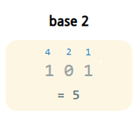
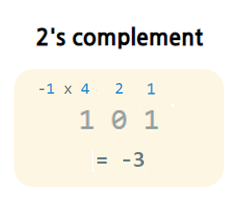

> Interview Cake의 Bit Manipulation 정리

### Binary Numbers
computers use binary number system (0, 1)

#### Unsigned Binary Numbers
use plain old base 2



#### Signed Binary Numbers
use __2's complement__ encoding to represent both negative and positive numbers



- the leftmost digit indicates positive (0) or negative (1)
- __advantages__:
    1. there is only way to represent zero (= sequence of only 0s)
    2. base operations (+, -, *) are the same regardless of whether numbers are positive or negative

if asked to convert binary into decimal or vice-versa (convert decimal to binary), ask __"is that in two's complement or not?"__

### Bitwise Operations

#### AND ( & )
return __1 if both bits are 1__; otherwise returns 0
```cpp
5 & 6 // = 4
0101 & 0110 // = 0100 (4)
```

#### OR ( | )
returns __1 if at least one bit is 1__; otherwise returns 0
```cpp
5 | 6 // = 7
0101 & 0110 // = 0111 (7)
```

#### XOR ( ^ )
returns __1 if exactly one of the bits is 1__; otherwise returns 0
```cpp
5 ^ 6 // = 3
0101 ^ 0110 // = 0011 (3)
```

#### NOT ( ~ )
__reverses the bits__
```cpp
~ 5 // = -6 in 2's complement
~ 0101 // = 1010 (-6)
```

### Bit Shifting
bit shift moves each digit the binary number to the left or right

#### Left Shifts ( << )
means __multiplying the number by the power of 2s__
```cpp
// lose leftmost bits and insert 0s on the right end
0010 << 1 // 0100
0010 << 2 // 1000
// 0010 (2) << 2 = 1000 (8)
```

#### Right Shifts ( >> )
languages handle arithmetic and logical right shifting in different ways. Most C++ compilers implement __logical right shifting on unsigned types__ and __arithmetic right shifting on signed types__
- __Logical Right Shifts__: means __dividing integers by power of 2s__ (throw away remainders)
```cpp
// lose rightmost bits and insert 0s on the left end
1011 >> 1 // 0101
1011 >> 3 // 0001
// 0101 (5) >> 1 = 0010 (2)
```
- __Arithmetic Right Shifts__: can __preserve number's sign__
```cpp
// lose rightmost bits and extend left end
1011 >> 1 // 0101
0011 >> 2 // 0000
// 0010 (2) << 2 = 1000 (8)
```

### Integer Overflow
the variable's value > computer's allocated memory
- examples:
    - sextrillion (= a billion trillion; 70 bits) can't fit in modern computers 64 bits
    - result of multiplication can't fit in 64 bits
- __Handling Integer Overflows__:
    - C++ or Java: processor will throw out the bits that don't fit
    - Python: will automatically allocate space for larger number
    - Swift: throw an error
- __Prevent Integer Overflow__:
    - C++: reduce likelihood by using larger integer types
    - use overflow-checking features provided by compiler or interpreter